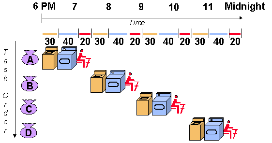

**PIPELINING**

**UNDERSTANDING PIPELINING WITH SIMPLE EXAMPLE:**

Let's
imagine you are doing laundry. Traditionally, you might wash all of your
clothes, then dry them all, and then fold them all. This is a
non-pipelined approach.

A
pipelined approach to laundry would involve having one person wash
clothes while another dries them, and a third person folds them. This
way, all three tasks can be happening simultaneously, which can
significantly speed up the overall laundry process.

**PIPELINING IN COMPUTER PROCESSORS**

Pipelining enhances processor efficiency by breaking down instruction
execution into specialized stages. These stages function like an
assembly line, enabling concurrent processing of multiple instructions
at different stages. This technique, also known as pipeline processing,
improves overall throughput by overlapping instruction execution .

*A typical pipelined processor with its stages:*

*Fetch*: In this stage, the processor retrieves an instruction from
memory.

*Decode*: The instruction is decoded to understand what operation needs
to be performed and what data is required.

*Execute*: This may involve calculations, data manipulation, or memory
access.

*Memory Access*: If the instruction requires reading or writing from
memory, this stage handles that operation.

*Write Back*: The results of the operation are written back to the
registers or memory.

**ADVANTAGES OF IMPLEMENTING PIPELINING:**

*Improved throughput:* Pipelining can improve the throughput of a
process by allowing multiple stages of the process to be executed
simultaneously.

*Reduced idle time*: In a non-pipelined process, resources may be idle
while waiting for other stages of the process to complete. Pipelining
can help to reduce this idle time.

*Increased efficiency:* By improving throughput and reducing idle time,
pipelining can lead to increased efficiency.

**DISADVANTAGES OF IMPLEMENTING PIPELINING:**

*Data Hazards:* When instructions depend on the results of previous
instructions, pipelining can stall to ensure correct execution.

*Control Hazards:* Branching instructions (if/else statements) can
disrupt the flow of instructions in the pipeline, as the processor might
need to fetch a new instruction from a different location in memory.

*Increased Complexity:* Pipelined processors are more complex to design
and manage compared to non-pipelined processors.

**RECENT TRENDS IN PIPELINING:**

*Integration of AI and Machine Learning :* AI/ML is playing a bigger
role in CI/CD pipelines. These technologies can be used to identify
vulnerabilities in code, optimize pipeline execution, and even predict
potential issues before they occur.

*Embracing Edge Computing:* As more data processing happens at the
"edge" (closer to where data is generated), CI/CD pipelines need to
adapt. Expect to see pipelines that can handle distributed processing
and integrate seamlessly with edge computing environments.

*Leveraging Machine Learning (ML) for Design and Optimization:* Machine
learning is being used to automate pipeline design and optimize data
flow. This can help to improve the efficiency and accuracy of data
pipelines.

**CONCLUSION:**

Pipelining is a powerful technique that can be used to improve the
throughput and efficiency of a process. However, it is important to
consider the limitations of pipelining before using it.
