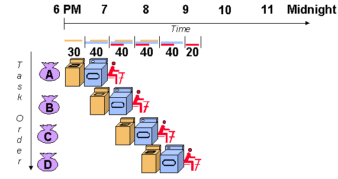

**PIPELINING**

**UNDERSTANDING PIPELINING WITH SIMPLE EXAMPLE:**

Let's
imagine you are doing laundry. Traditionally, you might wash all of your
clothes, then dry them all, and then fold them all. This is a
non-pipelined approach.

A
pipelined approach to laundry would involve having one person wash
clothes while another dries them, and a third person folds them. This
way, all three tasks can be happening simultaneously, which can
significantly speed up the overall laundry process.

**PIPELINING IN COMPUTER PROCESSORS**

Pipelining enhances processor efficiency by breaking down instruction
execution into specialized stages. These stages function like an
assembly line, enabling concurrent processing of multiple instructions
at different stages. This technique, also known as pipeline processing,
improves overall throughput by overlapping instruction execution .

*A typical pipelined processor with its stages:*

*Fetch*: In this stage, the processor retrieves an instruction from
memory.

*Decode*: The instruction is decoded to understand what operation needs
to be performed and what data is required.

*Execute*: This may involve calculations, data manipulation, or memory
access.

*Memory Access*: If the instruction requires reading or writing from
memory, this stage handles that operation.

*Write Back*: The results of the operation are written back to the
registers or memory.

**ADVANTAGES OF IMPLEMENTING PIPELINING:**

*Improved throughput:* Pipelining can improve the throughput of a
process by allowing multiple stages of the process to be executed
simultaneously.

*Reduced idle time*: In a non-pipelined process, resources may be idle
while waiting for other stages of the process to complete. Pipelining
can help to reduce this idle time.

*Increased efficiency:* By improving throughput and reducing idle time,
pipelining can lead to increased efficiency.

**DISADVANTAGES OF IMPLEMENTING PIPELINING:**

*Data Hazard:* Data hazards occur when there is a dependency between
instructions that are processed in different stages of the pipeline,
leading to potential stalls or incorrect results.

Example: Consider the following MIPS code:

add $t0, $t1, $t2

sub $t3, $t0, $t4

In this example, the second instruction depends on the result of the
first instruction ($t0). If the pipeline doesn't handle this dependency
properly, it may cause a data hazard. For instance, if the sub
instruction is fetched before the add instruction completes execution,
it will use the incorrect value of $t0, leading to an incorrect result.

2.Control Hazard:

Control hazards (also known as branch hazards) occur when the pipeline
needs to make a decision based on the outcome of a previous instruction,
such as a branch instruction, but the decision cannot be made until
later stages of the pipeline.

Example: Consider the following MIPS code:

Beq $t0, $t1, Label

add $t2, $t3, $t4

Here, the execution of the add instruction depends on the outcome of the
beq instruction. If the branch is taken, the next instruction to execute
will be the one at Label; otherwise, it will be the add instruction.
However, this decision cannot be made until the beq instruction reaches
the execution stage of the pipeline. If the pipeline fetches subsequent
instructions before resolving the branch, it may lead to incorrect
instruction fetches or wasted cycles.

*Increased Complexity:* Pipelined processors are more complex to design
and manage compared to non-pipelined processors.

PIPELINING IN REAL LIFE APPLICATIONS:

1.Web Browsers: When you load a webpage in a web browser, the browser
uses pipelining to fetch and render various elements of the page
simultaneously. For example, while one part of the browser is
downloading HTML content, another part might be fetching images or
executing JavaScript code. This parallel processing improves the overall
speed and responsiveness of the browsing experience.

2.Graphics Processing Units (GPUs): GPUs employ pipelining extensively
to efficiently process graphics-intensive tasks such as rendering 3D
graphics or performing complex computations for machine learning
algorithms. Pipelining allows GPUs to execute multiple instructions
concurrently across different processing units, maximizing throughput
and performance.

3.Network Routers: In network routers, pipelining is used to handle the
processing of data packets as they travel through the network. Each
packet typically goes through multiple stages, such as routing decision,
packet forwarding, and error checking, in a pipelined manner. This
allows routers to process multiple packets simultaneously, enabling
efficient data transmission and routing in large-scale networks.

**CONCLUSION:**

Pipelining is a powerful technique that can be used to improve the
throughput and efficiency of a process. However, it is important to
consider the limitations of pipelining before using it.
